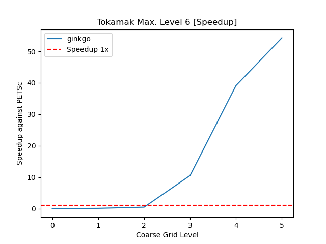
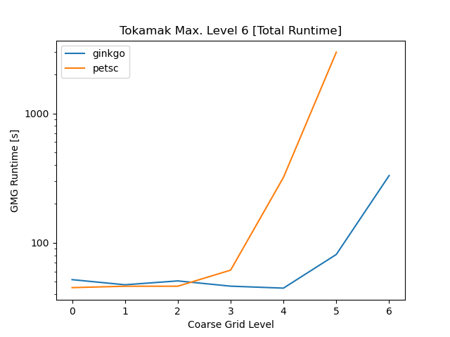
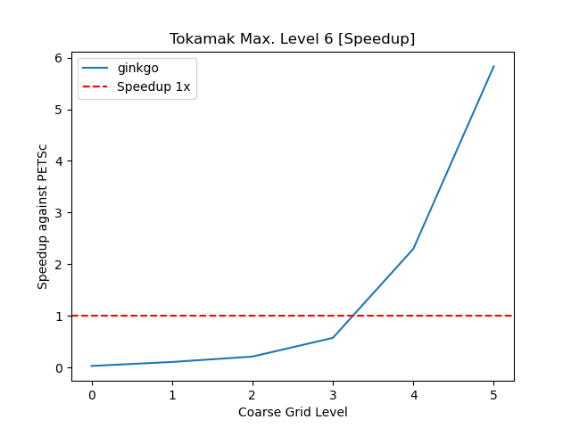

# What works?

- CG solver (with ILU)
- Runs on 1 GPU
- Uses agglomeration for parallelization
  - assembles on 1 CPU core

# Results

- App Tokamak with GMG
- Runs in parallel on 1 socket (20 ranks)
- Compare PETSc and Ginkgo coarse grid solver
- PETSc in parallel
- Ginkgo on GPU + agglomeration

---

---

---

# Fair Results

- Same setting
- PETSc without preconditioner (default)
- Ginkgo without preconditioner

---

---

# Todo

- Add MINRes to Ginkgo (?)
- Customize Ginkgo (solver/preconditioner)
- Reduce assembly cost
  - parallelize on CPU

# (Far) Future

- Distributed Ginkgo solver
- Assemble on GPU
